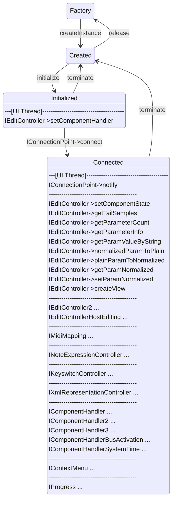

>/ ... / [VST 3 Workflow Diagrams](Index.md)
>
># Edit Controller Call Sequence

**Related pages:**

- [Audio Processor Call Sequence](Audio+Processor+Call+Sequence.md)

---

>ⓘ **Note**\
>All Edit Controller methods must be called from the **UI Thread**
